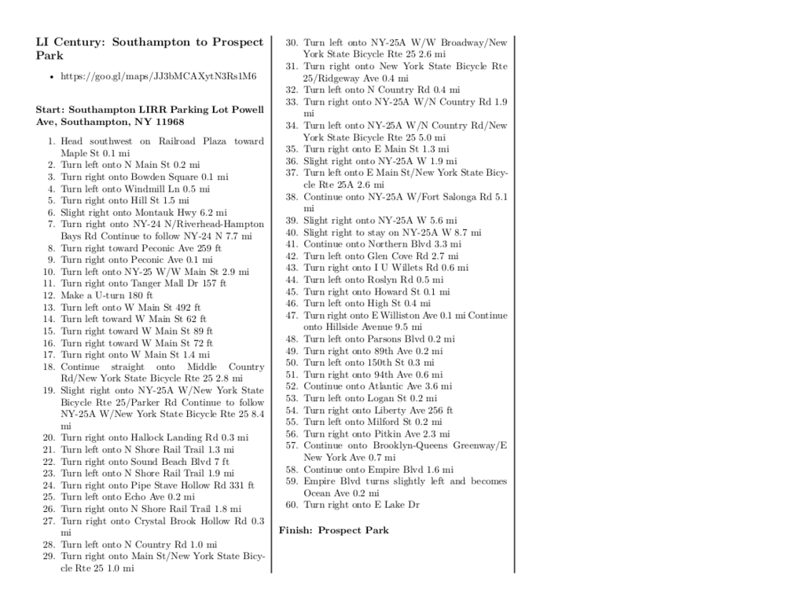

# Convert Markdown Cue Sheet to Pocket-sized PDF

## What this does:
* Write out the directions for your bike ride in a nice simple Markdown format. Then convert it to a printable format sized appropriately to be folded or cut and stashed in your pocket or a small map widow on your bicycle.
* This is a Makefile that uses pandoc to take a markdown file and format it as a landscape-oriented pdf sheet with columns. Like this:
	* 


## Requirements:
* Pandoc:
	* A more recent version. I was getting errors trying this with an older version of pandoc on debian.
* Latex:
	* A reasonably full install. Needs multicol package.
* GNU Make
	* If you are on a Linux system, you probably already have this.


## How to use:
* Write up your cue sheet directions in markdown.
* Edit the [Makefile](./Makefile) to point at the cue sheet markdown (.md) file you want to format.
* Run: ```make```
* Compiled files will be in built-files directory (in html and pdf).
* Run ```make clean``` to remove the buit-files directory


## To get cues from google maps:
* Using a computer (since there's no way to edit a route on a phone), put in your start and end addresses. Set to bicycle directions.
* Edit your route by dragging points on it until you have a reasonable route instead of Google's default nonsense.
* Click open details for the directions.
* Select all directions and copy from website (don't print as pdf, that can result in formatting screw-ups) 
* In text editor (I use vim):
	* paste directions in
	* Join distance lines onto directions lines (J in vim)
	* Add count of steps with: :'<,'>!cat -n (use ctrl-v to select vertically and then I to insert for every line; some cleanup with ctrl-v might also be necessary)
		* Alternatively, Put in * [ ] At front of every line to get checkboxes instead of numbers.
		* This can be useful if you are checking off as you go.
		* But generally numbers will make it easier to track where you are.
		* (Apparently Latex doesn't understand markdown numbers+checkboxes, so you have to choose one or the other.)
* You can just stop here and compile with all of Google's prolix directions (and built-in ads). But I recommend spending some time cleaning them up.


## Cleaning up your cues
* There's two reasons to do this sometimes-tedious step:
	1. Giving your cues brevity and concision will make them easier to follow on the road
	2. Going through each step while referencing the map will help you build out your mental map
		* A better mental map of your ride will make your cues work better for you.
		* Your ride will be more enjoyable if you understand where you are without having to look at your phone. (Maybe just my opinion.)
		* It's extremely rewarding to have a robust mental map of an area. (Again, maybe just my opinion.)
* So first, do a pass through your cue sheet file and edit down useless information from Google's too-detailed directions: 
	* delete "continue on" and "straight ahead" and "slight turn" type stuff
	* remove excess turns (basically any turn that is within sight of the previous turn)
	* strip out embedded ads in the form of "Pass by xxx" (usually a bank or fast food restaurant)
	* remove "walk your bicycle" lines
	* remove any other extraneous information
* Then go back and reference your cues turn-by turn while following the route zoomed in very closely on Google maps.
	* You don't have to commit anything to memory explicitly -- that's what the cue sheet is for!
	* But you want all your cues to make *sense* relative to the map.
* And finally, before you go riding, you might want to make sure you have a map as a backup in case you get off track with your cues. Your phone is the obvious backup here. But don't dismiss paper maps. I almost never bring my phone on rides, and paper maps have saved me from brutal detours a number of times.


## Messing around with the configuration:
* If you want to make adjustments to the number of columns, vertical lines, etc; edit [columns-format-prepend.md](./columns/columns-format-prepend.md)
	* See documentation from columns.lua maintainer in "How this was made" section for more details.
* There is also a make target that runs on just your cue sheet without adding the colums-format-prepend.md file:
	* ```make hand-formatted```
	* This target will build your markdown file into a pdf without adding the columns formatting.
	* Useful if you want to manually place the columns formatting so it begins part-way down the document.
	* For an example see [Southampton-to-ProspectPark.md](cue-sheets/Southampton-to-ProspectPark.md)
	* More details in the Makefile


## Troubleshooting:
* Make sure you have a fairly recent version of Pandoc.
* If you get a ```I can't write on file `input.pdf'``` from pandoc/Latex, then you have run out of memory. Try closing software, rebooting, increasing swap, etc.


### How this was made:
* All I did to make this script was simplify a version of this Makefile for building books from markdown:
	* https://github.com/evangoer/pandoc-ebook-template
	* Under an MIT license
* And add in this lua script to use mulicols from markdown:
	* columns.lua:
		* is from: https://github.com/jdutant/columns
		* Documented by: https://levelup.gitconnected.com/use-columns-adjust-margins-and-do-more-in-markdown-with-these-simple-pandoc-commands-adb4c19f9f35
		* Under an MIT license
	* I also had to lightly modifiy this file for it to use the multicols call in multicols* mode that sets multicols to use unbalanced columns.


## Resources:
* An overly-long argument for the merits of the [cue sheet](./supporting-materials/why-cue-sheets.md).
* The cue-sheets/ directory contains a number of my own rides from decades of riding around NYC and NY State. Give them a try if you are in New York!


## License:
* MIT
* See: [LICENSE](./LICENSE)


